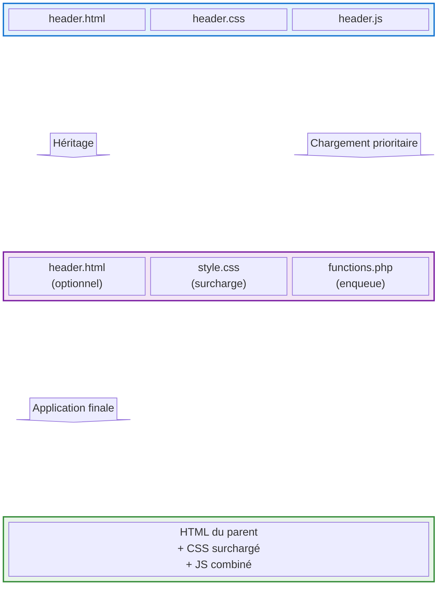
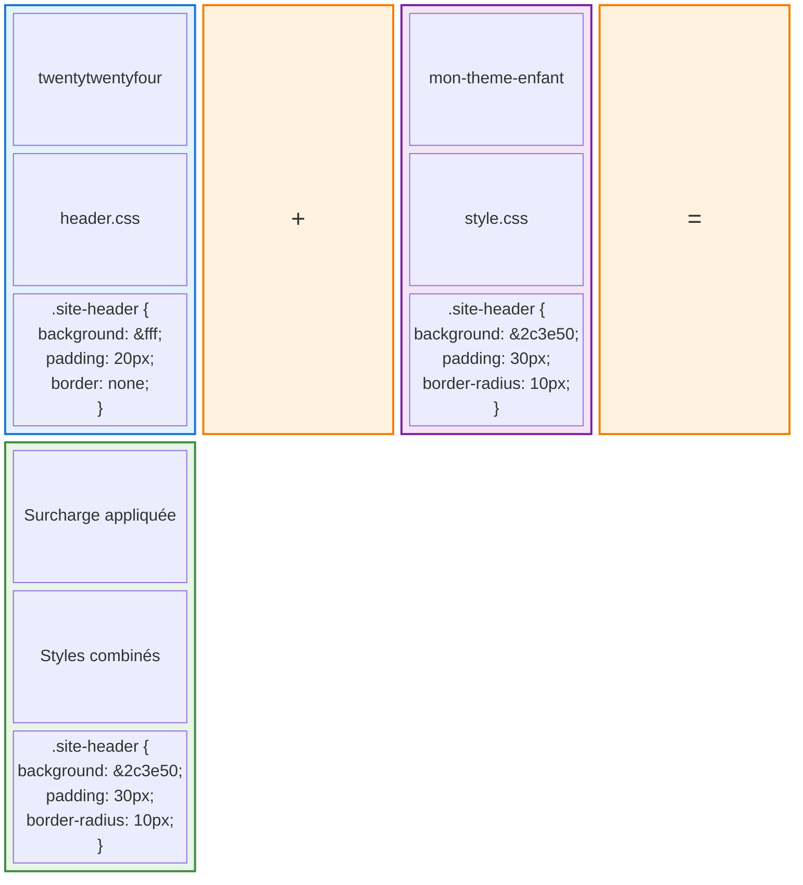
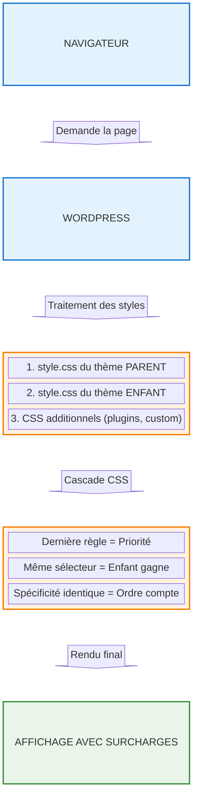
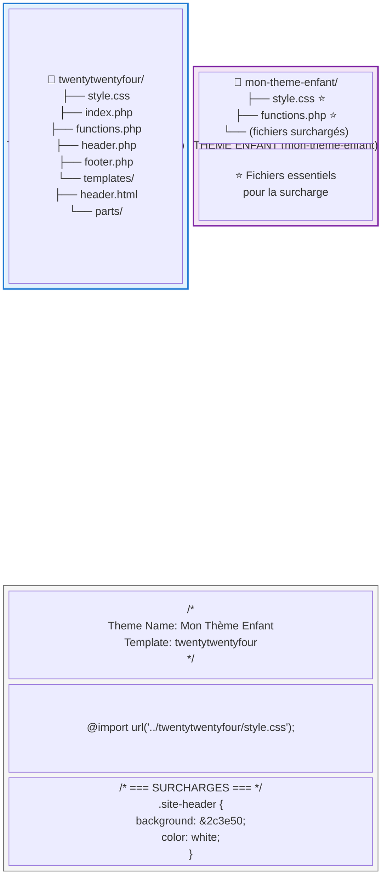
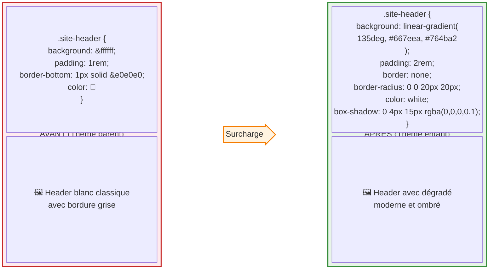
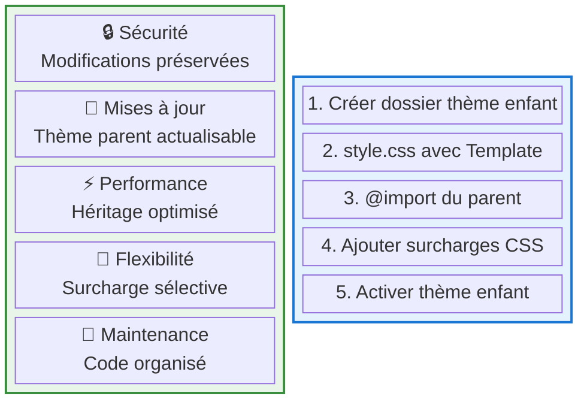
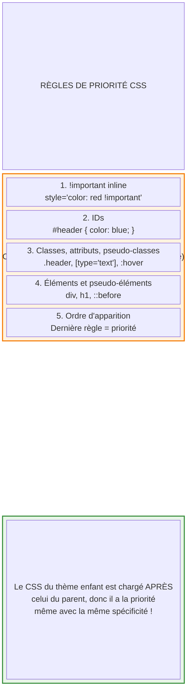

# Schéma : Surcharge CSS avec les Thèmes Enfants WordPress

## Vue d'ensemble de la surcharge CSS

Ce schéma illustre comment un thème enfant permet de surcharger les styles CSS d'un thème parent, en prenant l'exemple d'un composant header avec ses fichiers HTML, CSS et JavaScript.

## Détail de la surcharge CSS : Exemple header

## Ordre de chargement des fichiers CSS

## Structure fichiers : Thème parent vs Thème enfant

## Exemple concret : Surcharge du header

## Avantages de la surcharge par thème enfant

## CSS spécifique : Règles de priorité

---

## Résumé technique

**La surcharge CSS avec les thèmes enfants fonctionne grâce à :**

1. **Héritage** : Le thème enfant hérite de tous les fichiers du parent
2. **Ordre de chargement** : CSS enfant chargé après CSS parent
3. **Cascade CSS** : Dernière règle avec même spécificité = priorité
4. **Sélectivité** : Seuls les styles redéfinis sont surchargés
5. **Sécurité** : Modifications préservées lors des mises à jour

**Fichiers clés :**
- `style.css` : Contient les surcharges CSS
- `functions.php` : Gère l'enqueue des styles
- Template header : Indique le thème parent

Cette approche garantit une personnalisation sûre et maintenable de l'apparence WordPress.
